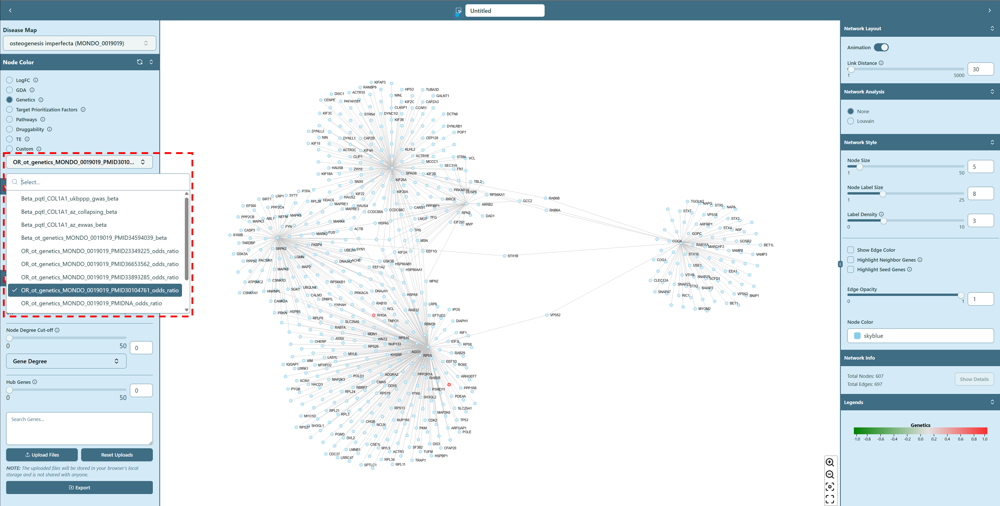

# Genetics

**Odd ratio or Beta-values from population studies, ranging from `-1` to `1`**

Genetics data in knowledge base is imported from Open Targets portal, and NHGRI GWAS catalog. The data is formatted to map SNPs level statistics to gene-level statistics i.e. odd-ratio or beta-value.

We have 2 different diseases available — ALS (Amyotrophic lateral sclerosis) and OI (Osteogenesis imperfecta).

## ALS & OI

ALS and OI Genetics data are from Open Targets. We use **\{**_score type_**\}\_\{source\}\_\{disease id\}\_\{publication id}** as the format, for example, “beta_otgenetics_MONDO0004976_PMID19451621”, shown as below:

