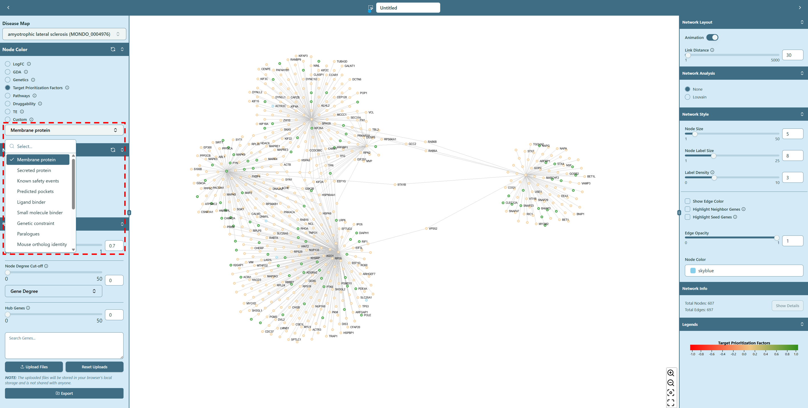

# Target Prioritization Factors

**Target prioritization factors from Open Targets Platform, value ranging from `-1` to `1`**

The Open Targets Platform’s Target Prioritisation view offers a comprehensive assessment of target-specific properties to aid in drug discovery. It aggregates data into four main categories: Precedence, Tractability, Doability, and Safety. A “traffic light” color-coding system is employed, where green indicates favorable attributes and red denotes potential concerns, enabling users to quickly evaluate targets for further investigation or de-prioritization.

We use **\{evidence-type\}** as the format, for example, “Membrane Protein”, shown as below:

